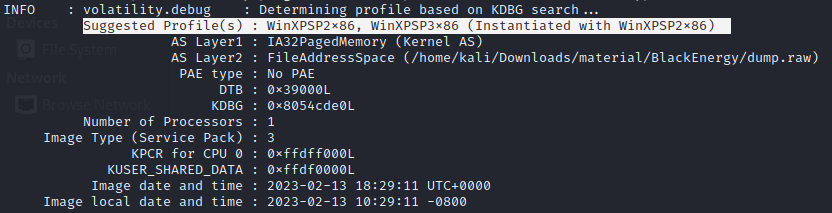
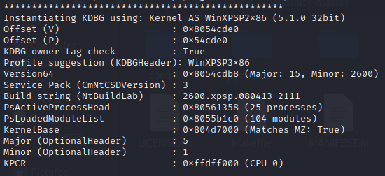
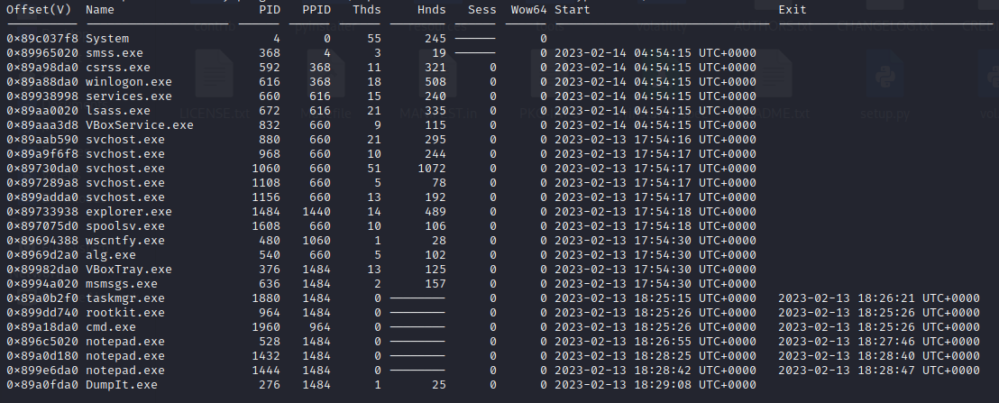
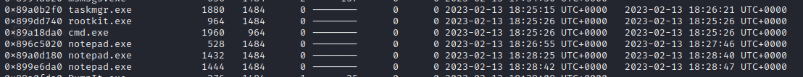
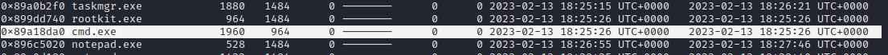
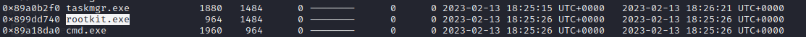
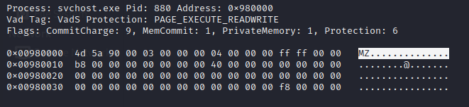
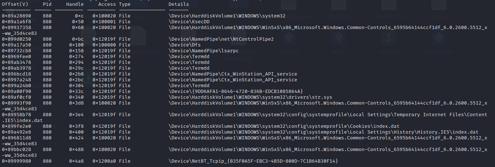
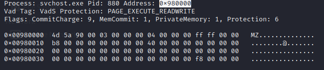

# BlackEnergy Blue Team Lab

[Challenge Link](https://cyberdefenders.org/blueteam-ctf-challenges/blackenergy/)

---

1. **Which volatility profile would be best for this machine?**  
   - Use `imageinfo` to find suggested profiles. Confirm with `kdbgscan`.
   -   
   -   
   - **Answer:** `WinXPSP2x86`

2. **How many processes were running when the image was acquired?**  
   - Use `pslist`. Total: 25; Exited: 6.
   -   
   -   
   - **Answer:** `19`

3. **What is the process ID of cmd.exe?**  
   -   
   - **Answer:** `1960`

4. **What is the name of the most suspicious process?**  
   -   
   - **Answer:** `rootkit.exe`

5. **Which process shows the highest likelihood of code injection?**  
   - Use `malfind`.
   -   
   - **Answer:** `svchost.exe`

6. **There is an odd file referenced in the recent process. Provide the full path of that file.**  
   - Use `handles`.
   -   
   -   
   - **Answer:** `C:\Windows\System32\drivers\str.sys`

7. **What is the name of the injected DLL file loaded from the recent process?**  
   - Use `ldrmodules` to identify DLLs that are hidden.
   -   
   - **Answer:** `msxml3r.dll`

8. **What is the base address of the injected DLL?**  
   - Use `malfind`.
   -   
   - **Answer:** `0x980000`