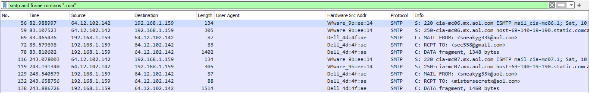
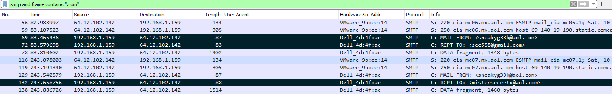

# Disclose The Agent

[Getting Started to LetsDefend](https://app.letsdefend.io/challenge/disclose-the-agent)

---

1. **What is the email address of Ann's secret boyfriend?**  
   - Use the filter `smtp and frame contains ".com"` to show SMTP packets containing email addresses.  
     
       
   
   - There are only three distinct emails found in the capture.  
     
       
   
   - **Answer:** `mistersecretx@aol.com`  
     
     

2. **What is Ann's email password?**  
   - Inspect the SMTP packets for login information.  
     
       
   
   - The password is shown as `NTU4cjAwbHo=` which is Base64 encoded.  
     
       
   
   - Decoding the Base64 string gives: `558r00lz`

3. **What is the name of the file that Ann sent to her secret lover?**  
   - Find the SMTP packet where Ann sends the file to her lover.  
     
       
   
   - Follow the TCP Stream of this packet to view the transmitted data.  
     
       
   
   - **Answer:** `secretrendezvous.docx`

4. **In what country will Ann meet with her secret lover?**  
   - Export the email object from the packet capture (select `rendezvous.eml`) and save it.  
     
       
   
   - Open the saved `.eml` file and examine its contents.  
     
       
   
   - Open the attached file inside the email to find the meeting location.  
     
       
   
   - **Answer:** Mexico

5. **What is the MD5 value of the attachment Ann sent?**  
   - Use any online MD5 hash calculator to get the hash of the attachment file.  
     
     [Online MD5 Calculator](https://md5file.com/calculator)  
   
   - **Answer:** `9e423e11db88f01bbff81172839e1923`  
     
     