# DumpMe Blue Team Lab

[Challenge Link](https://cyberdefenders.org/blueteam-ctf-challenges/dumpme/)

---

1. **What is the SHA1 hash of Triage-Memory.mem (memory dump)?**  
   - Use the `sha1sum` command.
   - **Answer:** `C95E8CC8C946F95A109EA8E47A6800DE10A27ABD`

2. **What volatility profile is the most appropriate for this machine?**  
   - Use `imageinfo` to get suggested profiles. Confirm with `kdbgscan`.
   - 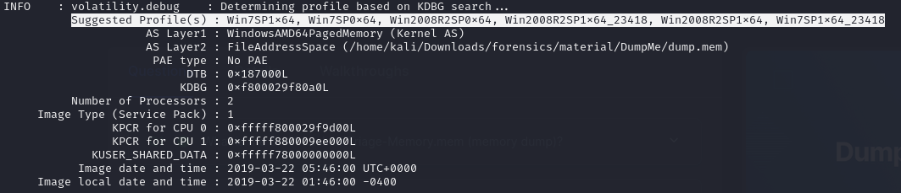  
   - 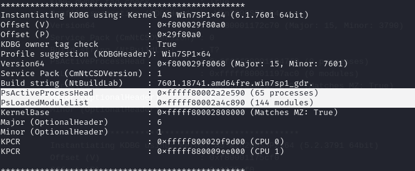
   - **Answer:** `Win7SP1x64`

3. **What was the process ID of notepad.exe?**  
   - Use `pslist` with `grep notepad.exe`.
   - 
   - **Answer:** `3032`

4. **Name the child process of wscript.exe.**  
   - Use `pstree` to find the child process.
   - 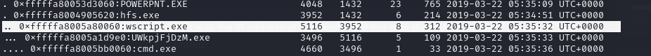
   - **Answer:** `UWkpjFjDzM.exe`

5. **What was the IP address of the machine at the time the RAM dump was created?**  
   - Use `netscan`.
   - 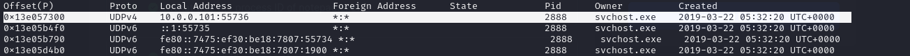
   - **Answer:** `10.0.0.101`

6. **Can you determine the IP of the attacker?**  
   - Investigate the `netscan` entry with **PID 3496**.
   - 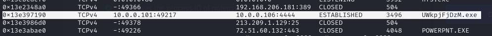
   - **Answer:** `10.0.0.106`

7. **How many processes are associated with VCRUNTIME140.dll?**  
   - Use `ldrmodules`.
   - 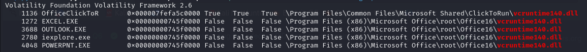
   - **Answer:** `5`

8. **After dumping the infected process, what is its md5 hash?**  
   - Use `procdump` for **PID 3496** and then `md5sum`.
   - **Answer:** `690ea20bc3bdfb328e23005d9a80c290`

9. **What is the LM hash of Bob's account?**  
   - Use `hivelist` + `hashdump`.
   - 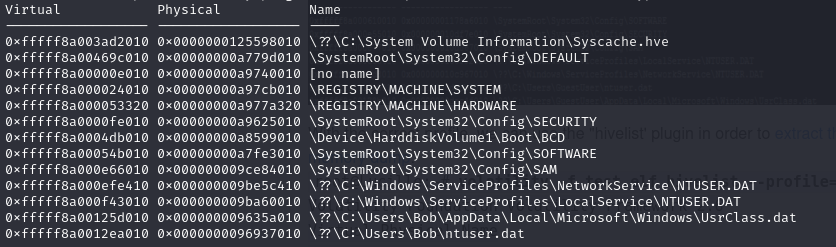  
   - 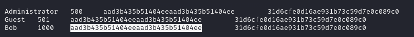
   - **Answer:** `aad3b435b51404eeaad3b435b51404ee`

10. **What memory protection constants does the VAD node at 0xfffffa800577ba10 have?**  
    - Use `vadinfo`.
    - 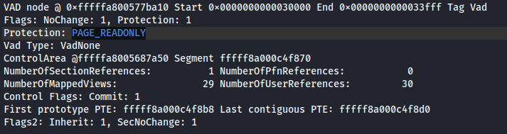
    - **Answer:** `PAGE_READONLY`

11. **What memory protection did the VAD starting at 0x00000000033c0000 and ending at 0x00000000033dffff have?**  
    - Use `vadinfo`.
    - 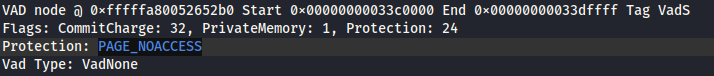
    - **Answer:** `PAGE_NOACCESS`

12. **There was a VBS script that ran on the machine. What is the name of the script?**  
    - Use `cmdline` with `wscript.exe`.
    - 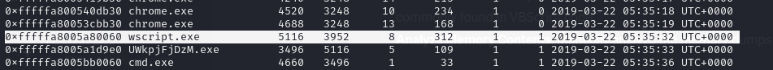  
    - 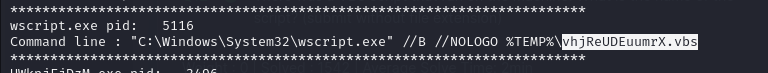
    - **Answer:** `vhjReUDEuumrX`

13. **An application was run at 2019-03-07 23:06:58 UTC. What is the name of the program?**  
    - Use `shimcache` and filter by timestamp.
    - **Answer:** `Skype.exe`

14. **What was written in notepad.exe at the time when the memory dump was captured?**  
    - Use `memdump` + `strings`.
    - 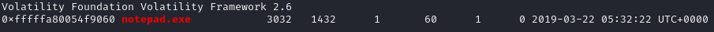  
    - 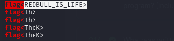
    - **Answer:** `flag<REDBULL_IS_LIFE>`

15. **What is the short name of the file at file record 59045?**  
    - Use `mftparser`.
    - 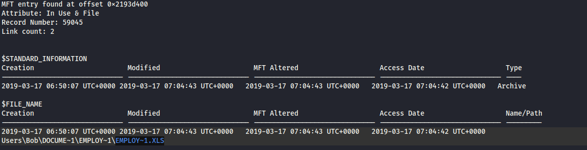
    - **Answer:** `EMPLOY~1.XLS`

16. **This box was exploited and is running meterpreter. What was the infected PID?**  
    - Derived from earlier `netscan` and process analysis.
    - 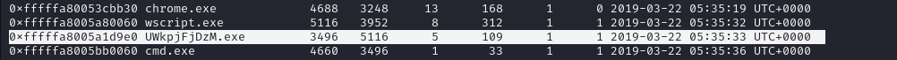
    - **Answer:** `3496`