# HawkEye Blue Team Lab

**Challenge Link:** [HawkEye | Blue Team Challenge](https://cyberdefenders.org/blueteam-ctf-challenges/hawkeye/)

---

## 1. How many packets does the capture have?

- **Answer:** `4003`  
  

---

## 2. At what time was the first packet captured?

- **Navigation:** `Statistics` → `Capture File Properties`
- **Answer:** `2019-04-10 20:37:07 UTC`  
  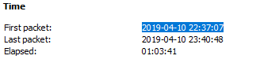

---

## 3. What is the duration of the capture?

- **Navigation:** `Statistics` → `Capture File Properties`  
  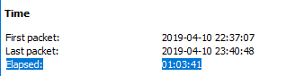

---

## 4. What is the most active computer at the link level?

- **Navigation:** `Statistics` → `Conversations`
- **Answer:** `00:08:02:1c:47:ae`  
  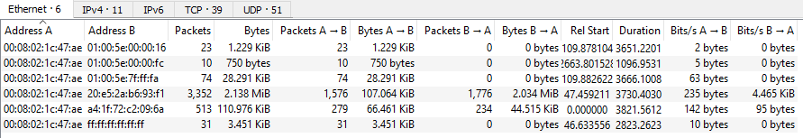

---

## 5. Manufacturer of the NIC of the most active system?

- **Tool:** [MAC Lookup](https://maclookup.app/)
- **Answer:** `Hewlett-Packard`  
  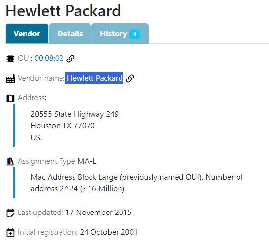

---

## 6. Where is the NIC manufacturer headquartered?

- **Answer:** `Palo Alto`  
  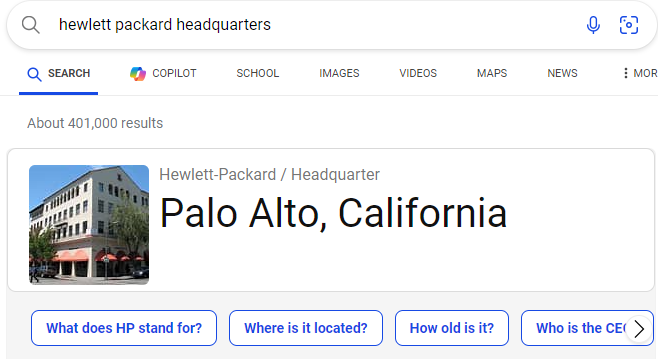

---

## 7. How many computers are involved in the capture?

- **Active IPs:** `10.4.10.2`, `10.4.10.4`, `10.4.10.132`
- **Excluded Broadcast IP:** `10.4.10.255`
- **Answer:** `3`  
  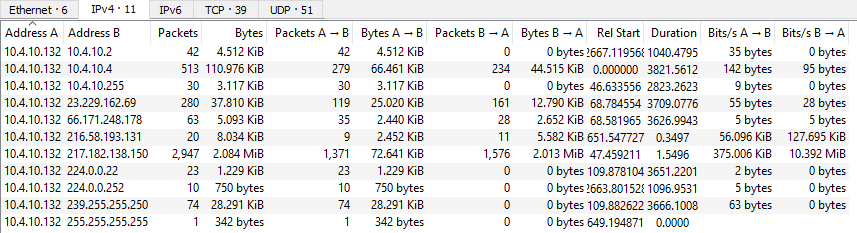

---

## 8. Name of the most active computer at the network level?

- **Filter:** `ip.addr == 10.4.10.132 and frame contains "PC"`
- **Answer:** `Beijing-5cd1-PC`  
  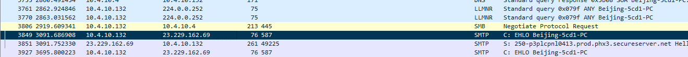

---

## 9. What is the IP of the DNS server?

- **Filter:** DNS protocol only
- **Answer:** `10.4.10.4`  
  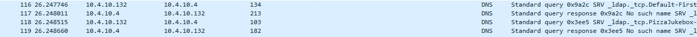

---

## 10. What domain is queried in packet 204?

- **Answer:** `proforma-invoices.com`  
  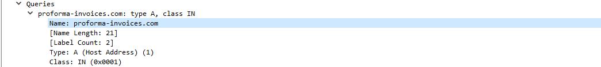

---

## 11. What is the resolved IP of the domain?

- **Answer:** `217.182.138.150`  
  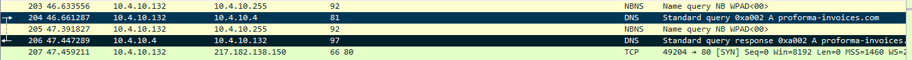  
  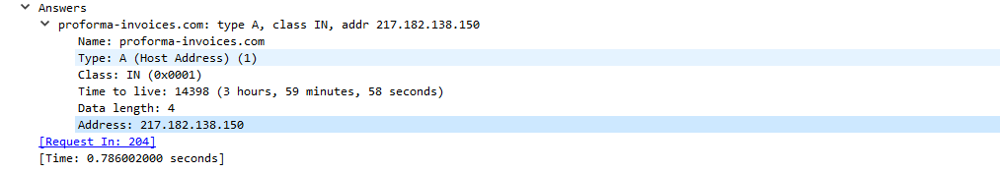

---

## 12. What country does the IP belong to?

- **Answer:** `France`  
  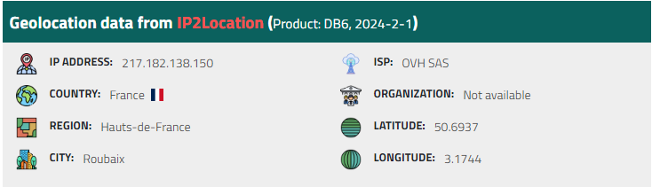

---

## 13. What OS does the victim's machine run?

- **Analysis:** `.exe` download from `10.4.10.132`
- **Answer:** `Windows NT 6.1`  
  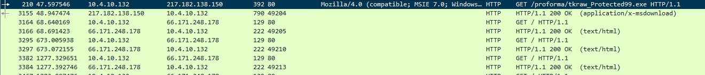  
  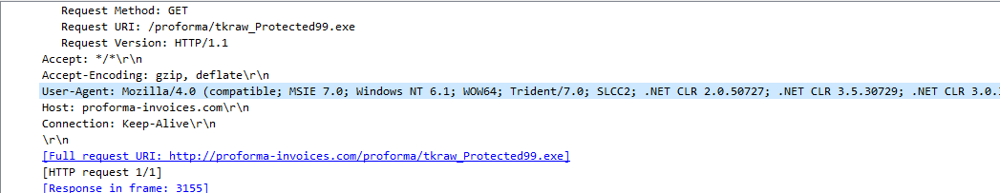

---

## 14. Name of the malicious file downloaded?

- **Answer:** `tkraw_Protected99.exe`  
  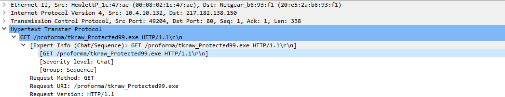

---

## 15. What is the MD5 hash of the downloaded file?

- **Steps:** `File` → `Export Objects` → `HTTP`
- **Answer:** `71826ba081e303866ce2a2534491a2f7`  
  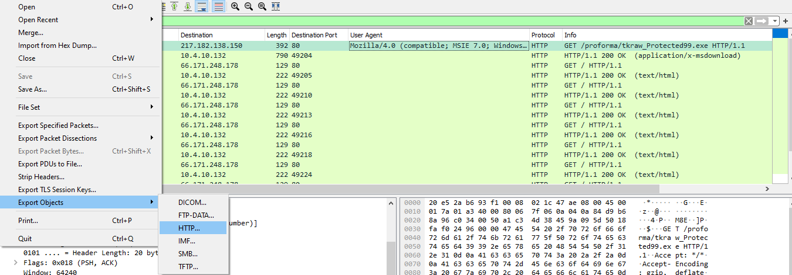

---

## 16. What software runs the malware web server?

- **Answer:** `LiteSpeed`  
  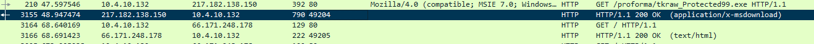  
  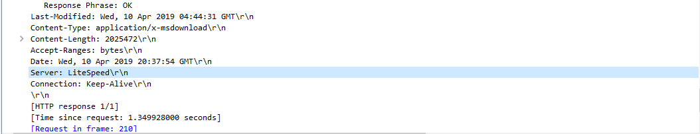

---

## 17. What is the public IP of the victim's computer?

- **Public Response IP:** `173.66.146.112` (responding to `10.4.10.132`)
- **Answer:** `173.66.146.112`  
  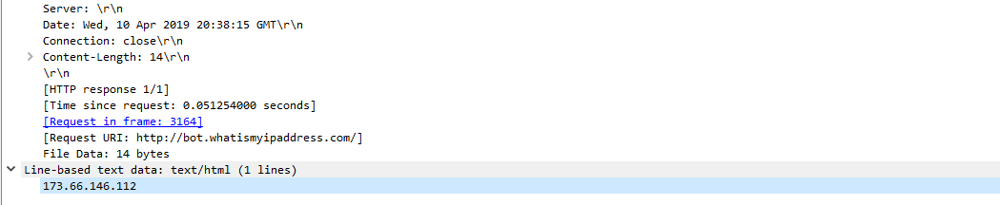

---

## 18. Where is the email server located?

- **SMTP Destination IP:** `23.229.162.69`
- **Answer:** *(From lookup)*  
  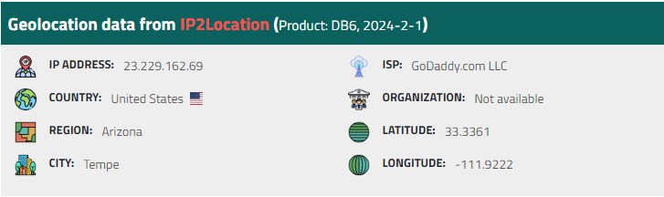

---

## 19. What software runs the email server?

- **Answer:** `EXIM 4.16`  
  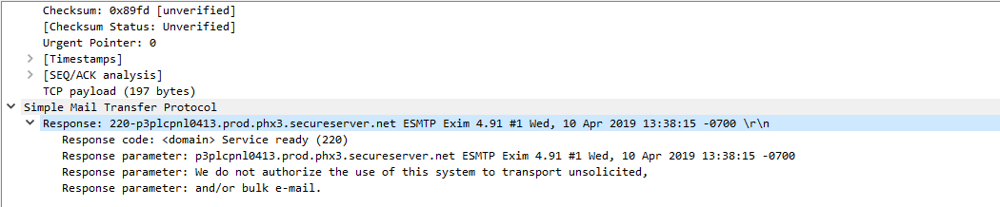

---

## 20. To which email is the stolen info sent?

- **Email:** `sales.del@macwinlogistics.in`  
  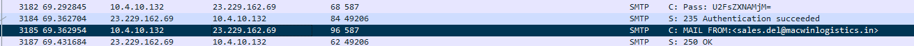

---

## 21. What is the password used by the malware?

- **Encoded:** Base64 decoded from SMTP auth
- **Answer:** `Sales@23`  
  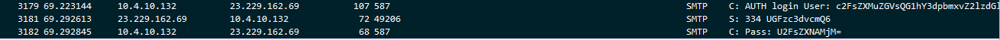

---

## 22. Which malware variant exfiltrated the data?

- **Process:**  
  - Filter SMTP
  - Follow TCP stream
  - Decode base64

  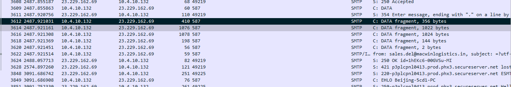  
  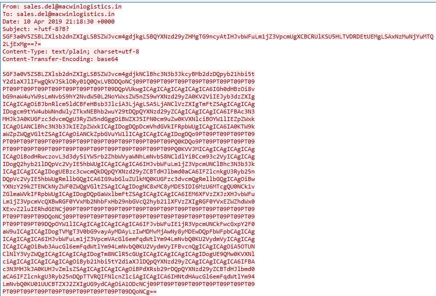  
  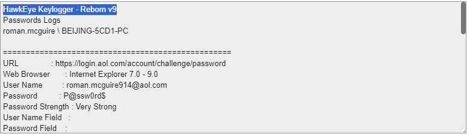

- **Answer:** *(Based on decoded result, typically HawkEye variant)*

---

## 23. What are the Bank of America credentials?

- **Format:** `username:password`
- **Answer:** *(From decrypted payload)*  
  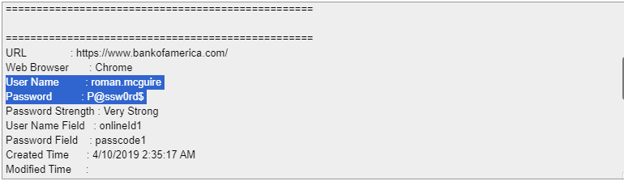

---

## 24. How often is data exfiltrated?

- **Method:** Calculate the time difference between two exfiltration events and divide by 60.
- **Answer:** `10 minutes`  
  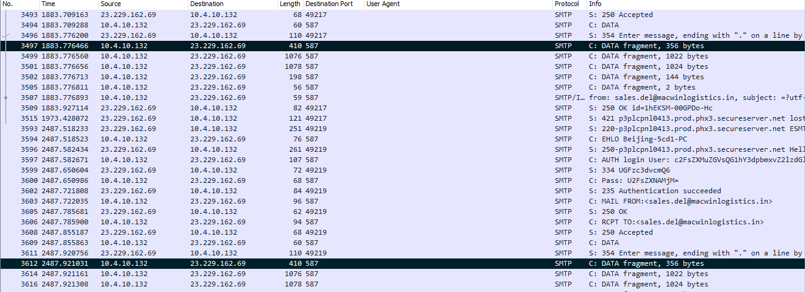

---