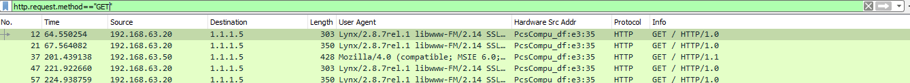
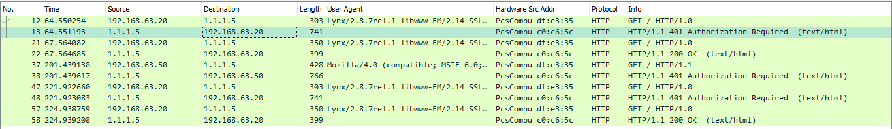
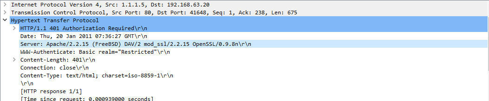
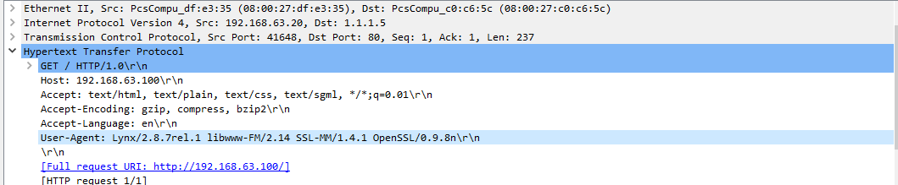
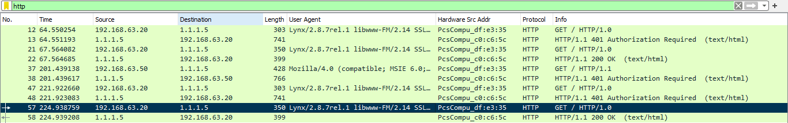
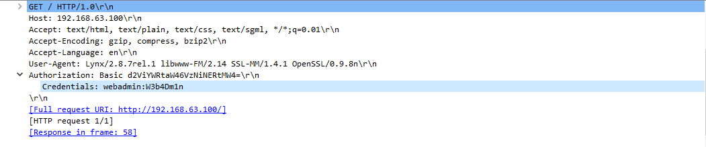

# Http Basic Auth

[Getting Started to LetsDefend](https://app.letsdefend.io/challenge/http-basic-auth)

---

1. **How many HTTP GET requests are in the pcap?**  
   - Apply a filter to show only HTTP GET packets.  
     
       
   
   - **Answer:** 5

2. **What is the server operating system?**  
   - The server IP is `1.1.1.5`.  
     
       
   
   - Review any HTTP GET response packets from this IP.  
     
       
   
   - **Answer:** FreeBSD

3. **What is the name and version of the web server software?**  
   - From the previous analysis, the answer is:  
     
     **`Apache/2.2.15`**

4. **What is the version of OpenSSL running on the server?**  
   - From the HTTP response packets, the OpenSSL version is:  
     
     **`OpenSSL/0.9.8n`**

5. **What is the client's user-agent information?**  
   - Review any HTTP GET request packet to find the User-Agent string.  
     
       
   
   - **Answer:** `lynx/2.8.7rel.1 libwww-fm/2.14 ssl-mm/1.4.1 openssl/0.9.8n`

6. **What is the username used for Basic Authentication?**  
   - All HTTP GET requests except the last one have no Authorization header.  
     
       
   
   - Inspecting the last HTTP GET request reveals the username.  
     
       
   
   - **Answer:** `webadmin`

7. **What is the user password used for Basic Authentication?**  
   - From the previous question’s decoded Authorization header, the password is:  
     
     **`W3b4Dm1n`**