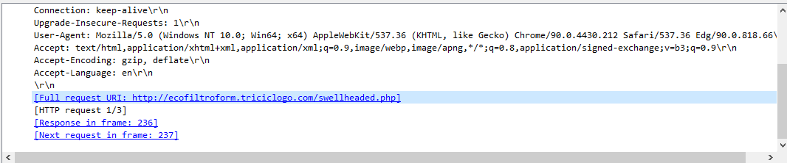

# Infection with Cobalt Strike

[Challenge Link](https://app.letsdefend.io/challenge/infection-cobalt-strike)

---

1. **What is one of the popular document signing services used by the attacker to deliver the malware?**  
   - Identified suspicious IP `10.7.5.134` involved in abnormal network activity.  
   - DNS queries reveal reference to a document signing service.
   -   
   -   
   -   
   - **Answer:** `docusign`

2. **What is the full URL used by the attacker to create the malicious document?**  
   - Found via HTTP GET requests.
   - HTML response uses a script referencing `docusign`.
   -   
   -   
   -   
   - **Answer:** `http://ecofiltroform.triciclogo.com/swellheaded.php`

3. **What kind of encoding technique is used by the attacker to create the malicious document?**  
   - Found within JavaScript embedded in HTML response.  
   - **Answer:** `Base64`

4. **What is the name of the malicious document opened by the user?**  
   - Found by inspecting the `swellheaded.php` response.
   -   
   -   
   - **Answer:** `0524_4109399728218.doc`

5. **What malware family does this malicious file belong to?**  
   - *(No screenshot provided — complete via sample analysis or VirusTotal scan.)*  
   - **Answer:** *(User to verify manually)*

6. **After the user interacts with the malicious file, what is the DLL run command?**  
   - *(Missing screenshots — can be obtained by checking execution artifacts or command-line evidence in logs.)*  
   - **Answer:** *(User to extract from further analysis)*

7. **What is the C2 URL?**  
   - Found by filtering HTTP POST requests from attacker-controlled IP.  
   -   
   -   
   - **Answer:** *(URL visible in the screenshot — user to insert)*

8. **What is the URL that serves the payload?**  
   - Found by searching `.exe` file downloads in the PCAP.
   -   
   -   
   - **Answer:** `http://gromber6.ru/6hjusfd8.exe`

9. **What is the name of the malware this payload links back to?**  
   - Identified by uploading the file to [VirusTotal](https://www.virustotal.com/gui/home/upload).  
   -   
   - **Answer:** `Ficker Stealer`

10. **What is the popular hacking framework being used in this campaign?**  
    - Based on the command-and-control patterns.  
    - **Answer:** `Cobalt Strike`

11. **What is the popular storage service used by the attacker to deliver the malware?**  
    - Confirmed via DNS/HTTP logs.
    -   
    - **Answer:** `Google Docs`