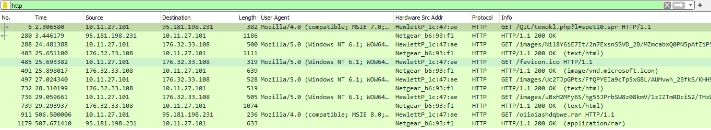
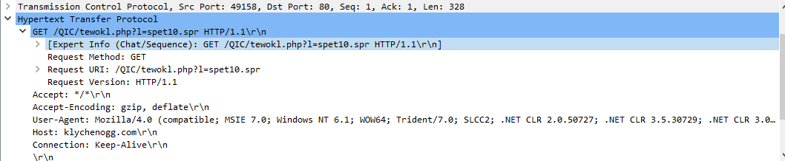
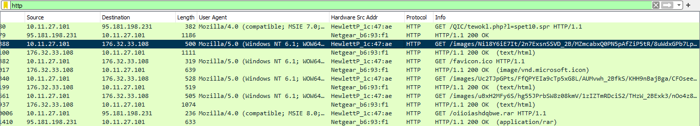
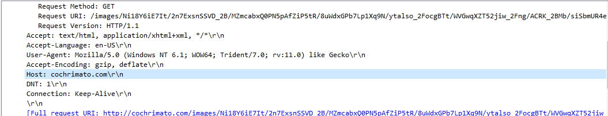
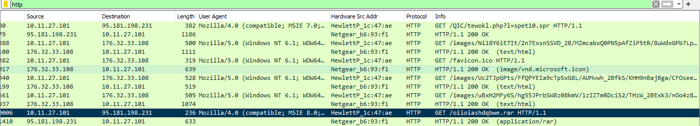
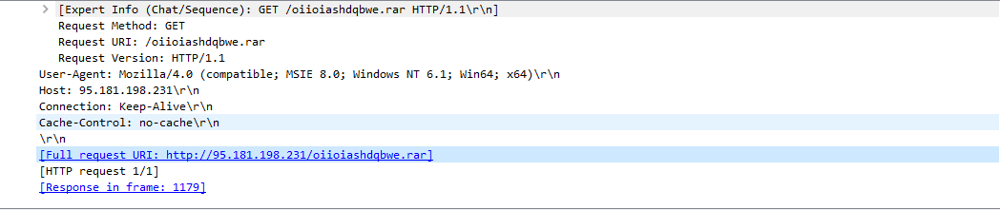
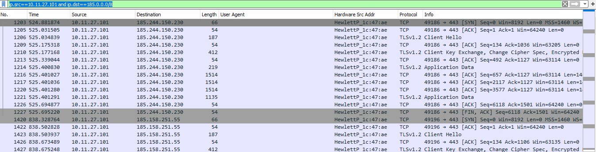
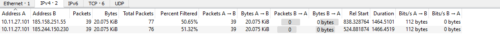

# Network Analysis – Malware Compromise

[Challenge Link](https://blueteamlabs.online/home/challenge/network-analysis-malware-compromise-e882f32908)

---

1. **What’s the private IP of the infected host?**  
   - Filter the traffic to show only HTTP packets.  
     
       
   
   - The first HTTP request shows a file with a `.spr` extension being requested.  
     
       
   
   - **Answer:** `10.11.27.101`

2. **What’s the malware binary that the macro document is trying to retrieve?**  
   - From the HTTP request in the previous step.  
   - **Answer:** `spet10.spr`

3. **From what domain HTTP requests with GET /images/ are coming from?**  
   - Check the HTTP GET packets requesting `/images/`.  
     
       
   
   - The domain is shown in the `Host` header.  
     
       
   
   - **Answer:** `cochrimato.com`

4. **What’s the full URL ending in .rar where Ursnif retrieves the follow-up malware from?**  
   - Locate the HTTP request to the `.rar` file.  
     
       
     
       
   
   - **Answer:** `http://95.181.198.231/oiioiashdqbwe.rar`

5. **What is the Dridex post-infection traffic IP address beginning with 185.?**  
   - Apply the filter: `ip.src==10.11.27.101 and ip.dst==185.0.0.0/8`  
     
       
   
   - Use the Conversations window in Statistics for a better view.  
     
       
   
   - **Answer:** `185.244.150.230`