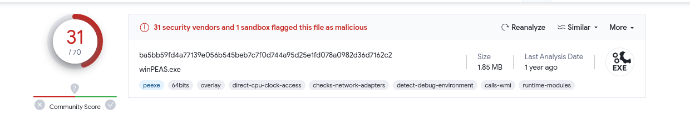

# Memory Analysis

[Challenge Link](https://app.letsdefend.io/challenge/memory-analysis)

---

1. **What was the date and time when Memory from the compromised endpoint was acquired?**  
   - Use the `windows.info` plugin to retrieve metadata about the memory dump.
     
     
   
   - **Answer:** `2022-07-26 18:16:32`

2. **What was the suspicious process running on the system? (Format: name.extension)**  
   - Run `windows.pslist` to review processes.  
   - Notably, `lsass.exe` appears **twice**, which is abnormal.
   - The legitimate `lsass.exe` should be launched by `wininit.exe`.  
   - The second instance with **PID: 7592** is spawned by `explorer.exe`, indicating it’s likely malicious.
     
       
       
     
   
   - **Answer:** `lsass.exe`

3. **Analyze and find the malicious tool running on the system by the attacker (Format: name.extension)**  
   - Dump files related to the suspicious `lsass.exe` process (PID 7592) using:
     ```bash
     python3 vol.py -f /path-to-dump-file windows.dumpfiles --pid 7592 | grep -i exe
     ```
     
     
   - Submit the executable to VirusTotal to identify it.
     
       
     
   
   - **Answer:** `winPEAS.exe`

4. **Which User Account was compromised? (Format: DomainName/USERNAME)**  
   - Use `windows.envars` to inspect environment variables of the process.
     
     
   
   - **Answer:** `msedgewin10/cyberjunkie`

5. **What is the compromised user password?**  
   - Use the `windows.hashdump` plugin to extract password hashes from memory.
     
     
   - Use an online cracking tool like [CrackStation](https://crackstation.net/) to crack the hash.
     
     
   
   - **Answer:** `password123`