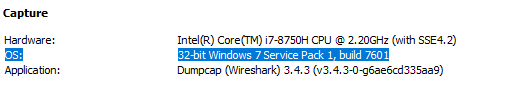
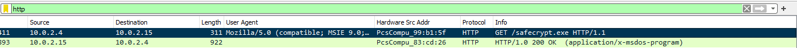
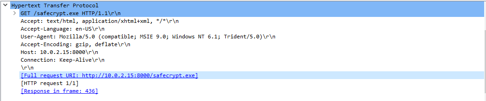
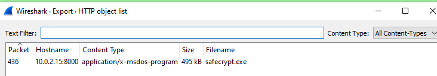
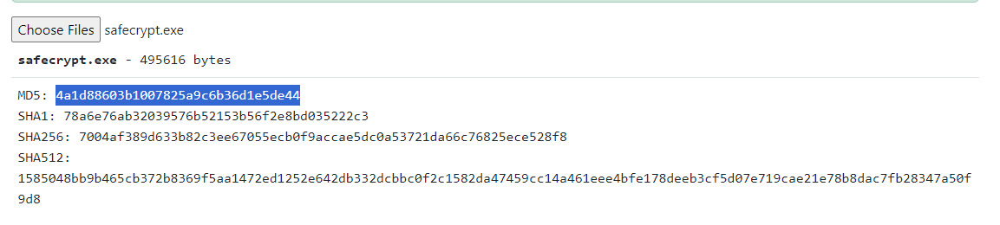
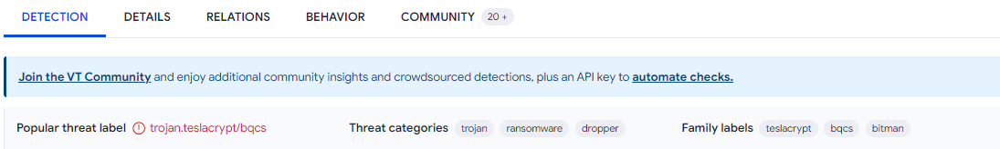
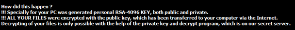
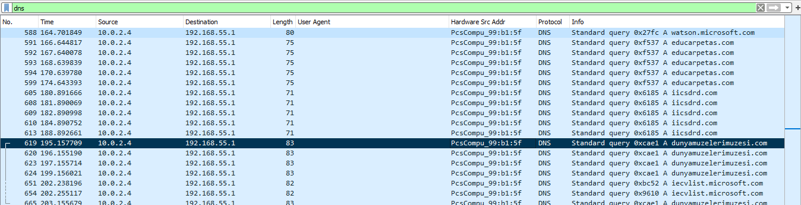
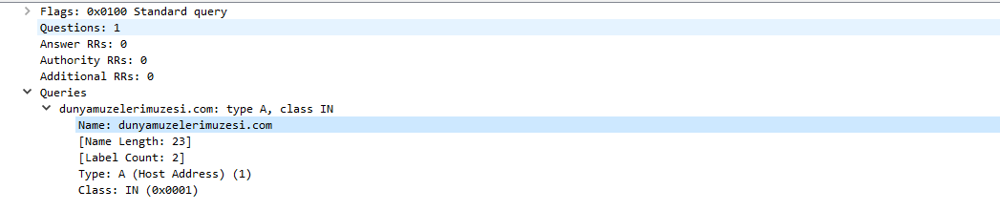

# Network Analysis Ransomware

[Challenge Link](https://blueteamlabs.online/home/challenge/network-analysis-ransomware-3dd520c7ec)

---

1. **What is the operating system of the host from which the network traffic was captured?**  
   - Open the **Capture File Properties** from the **Statistics** tab.  
     
       
   
   - **Answer:** `32-bit Windows 7 Service Pack 1, build 7601`

2. **What is the full URL from which the ransomware executable was downloaded?**  
   - Filter to display HTTP packets.  
     
       
   
   - Find the HTTP GET request for the ransomware.  
     
       
   
   - **Answer:** `http://10.0.2.15:8000/safecrypt.exe`

3. **Name the ransomware executable file.**  
   - From the previous question.  
   - **Answer:** `safecrypt.exe`

4. **What is the MD5 hash of the ransomware?**  
   - Go to **File > Export Objects > HTTP**, and export the file.  
     
       
   
   - Use an MD5 hash calculator like [md5file.com](https://md5file.com/calculator).  
     
       
   
   - **Answer:** `4a1d88603b1007825a9c6b36d1e5de44`

5. **What is the name of the ransomware?**  
   - Search the MD5 hash on [VirusTotal](https://www.virustotal.com/gui/home/upload).  
     
       
   
   - **Answer:** `TeslaCrypt`

6. **What is the encryption algorithm used by the ransomware, according to the ransom note?**  
   - Review the ransom note image included with the challenge.  
     
       
   
   - **Answer:** `RSA-4096`

7. **What is the domain beginning with ‘d’ that is related to ransomware traffic?**  
   - Filter to show DNS packets.  
     
       
     
       
   
   - **Answer:** `dunyamuzelerimuzesi.com`

8. **Decrypt the Tender document and submit the flag.**  
   - Use [Kaspersky's RakhniDecryptor](https://support.kaspersky.com/common/disinfection/10556) or similar tool to decrypt the file.  
   - **Answer:** `BTLO-T3nd3r-Fl@g`