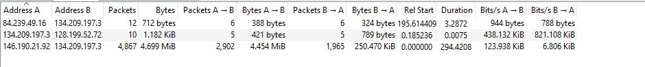
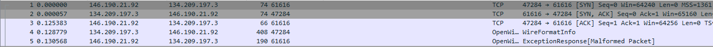
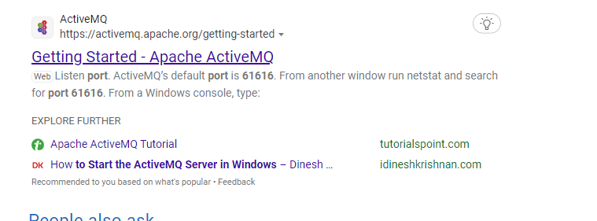
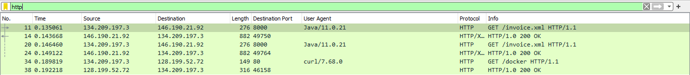
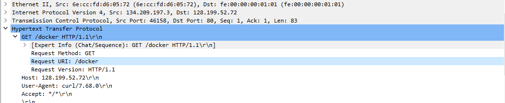
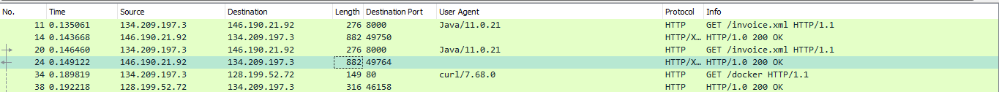
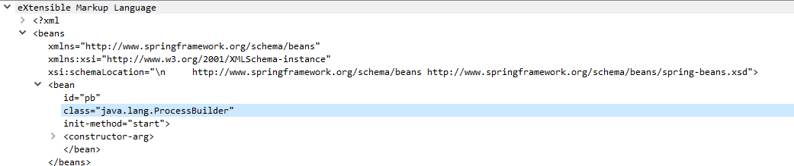
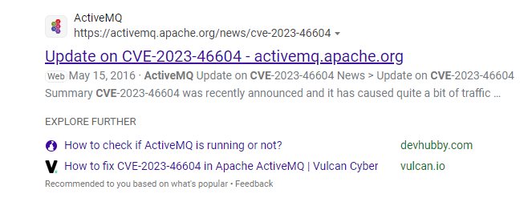

# OpenWire Blue Team Lab

**Challenge Link:** [OpenWire | Blue Team Challenge](https://cyberdefenders.org/blueteam-ctf-challenges/openwire/)

---

## 1. Identify the C2 IP Address

Blocking communication with a Command and Control (C2) server is crucial to prevent further data exfiltration or command execution.

- **Analysis:**  
  Using the **Statistics > Conversations** tab in Wireshark, we observe that the third conversation involves a significantly high number of packets—an indicator of possible data exfiltration.

  

- **Indicator:**  
  On further inspection of packet details, the IP address `**146.190.21.92**` is identified. This IP is responsible for sending **Malformed Packets**, suggesting malicious intent.

  

> **Answer:** `146.190.21.92`

---

## 2. Determine the Exploited Port Number

Identifying the exploited port helps understand the initial attack vector.

- **Observation:**  
  Packet 5, containing the malformed payload, was sent via **port 61616**.

> **Answer:** `61616`

---

## 3. Identify the Vulnerable Service

- **Research:**  
  A quick search reveals that **port 61616** is commonly associated with **Apache ActiveMQ**—a widely used open-source message broker.

  

> **Answer:** `Apache ActiveMQ`

---

## 4. Find the Second C2 Server

Attackers may use multiple servers for resilience and redundancy.

- **Technique:**  
  Applying an HTTP filter in Wireshark highlights traffic with another suspicious IP address: `**128.199.52.72**`.

  

> **Answer:** `128.199.52.72`

---

## 5. Discover the Dropped Reverse Shell File

- **Traffic Analysis:**  
  By monitoring the communication between the server and the second C2 IP, we find a suspicious executable named `**docker**` transferred.

  

> **Answer:** `docker`

---

## 6. Identify the Exploited Java Class

- **User-Agent Clues:**  
  Two HTTP packets with a `User-Agent` string containing "Java" suggest a Java-based exploit.

  

- **XML Payload Inspection:**  
  The second HTTP GET response includes an XML file that discloses the invoked Java class.

  

> **Answer:** *Exploit class found in XML payload*

---

## 7. Determine the CVE Identifier

- **Exploit Research:**  
  Based on the known service (Apache ActiveMQ) and behavior, the associated CVE is discovered through online research.

  

> **Answer:** `CVE-2023-46604`

---

## 8. Identify the Vulnerable Java Method

- **Technical Reference:**  
  The specific method that allows arbitrary code execution is detailed in Rapid7's analysis of the CVE.

> **Answer:** `BaseDataStreamMarshaller.createThrowable`  
> [Read more on AttackerKB](https://attackerkb.com/topics/IHsgZDE3tS/cve-2023-46604/rapid7-analysis?referrer=etrblog)

---