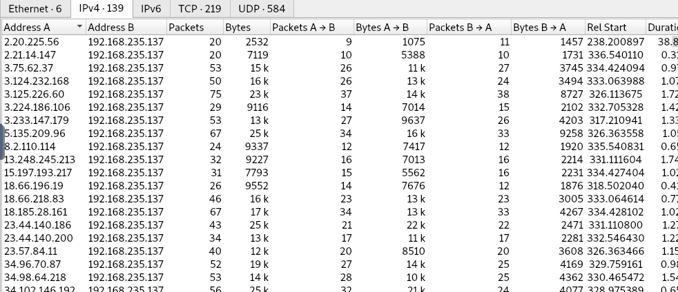
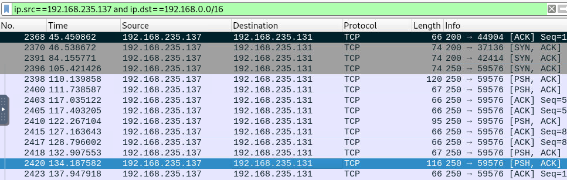
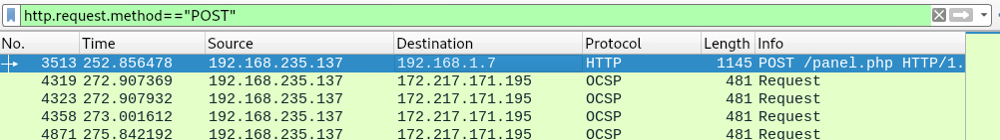
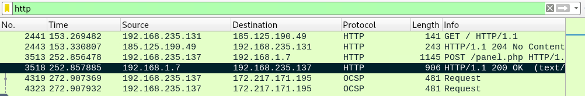
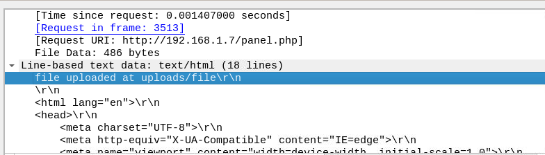
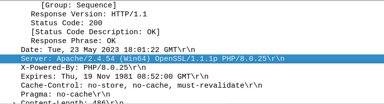
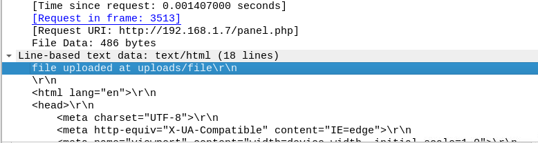
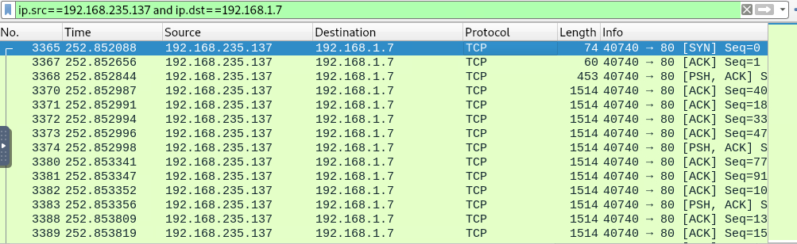

# PCAP Analysis

**Challenge Link:** [Getting Started to LetsDefend](https://app.letsdefend.io/challenge/pcap-analysis#virtual)

---

## 1. What are the IP addresses of the sender and receiver in the network communication?

- By reviewing Wireshark conversations, the device with IP `192.168.235.137` is causing malicious traffic, indicating this is the attacker IP likely targeting our internal network.  
  

- Searching traffic between private IPs reveals communication between the attacker IP and another private IP.  
  

- **Answer:** `192.168.235.137`, `192.168.235.131`

---

## 2. What is the IP address of the web server to which a file was uploaded?

- **Answer:** `192.168.235.137`  
  

---

## 3. What is the name of the file sent through the network?

- Review the HTTP POST packet response for details.  
  

- **Answer:** `file`  
  

---

## 4. What is the name of the web server hosting the upload?

- From the same packet in question 3.  
- **Answer:** `Apache`  
  

---

## 5. What directory was the file uploaded to?

- From the same packet in question 3.  
- **Answer:** `uploads`  
  

---

## 6. How long did it take the sender to send the encrypted file?

- Filter traffic between attacker and server. Subtract the time of the last TCP packet from the first TCP packet.  
  

- **Answer:** `0.0073` seconds

---