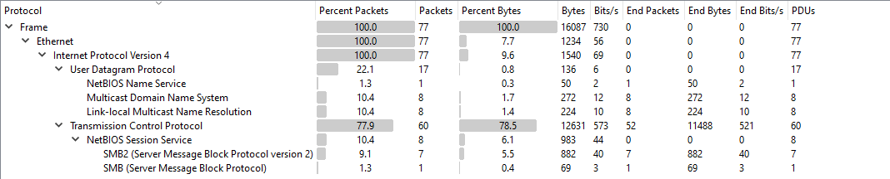
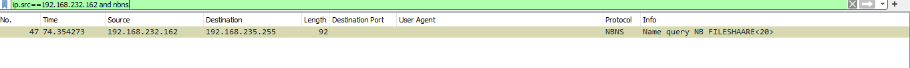
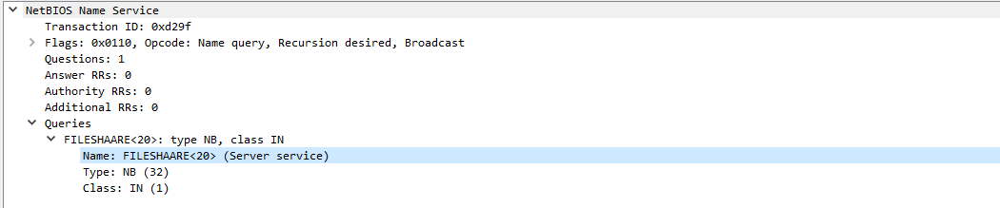
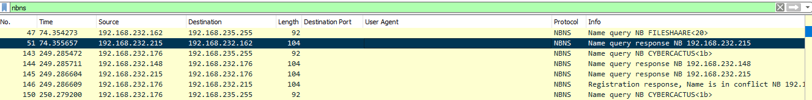
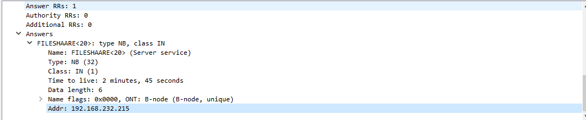
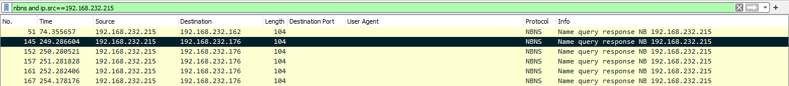
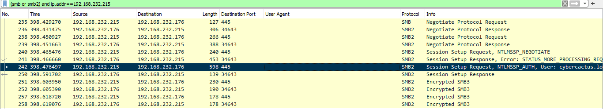
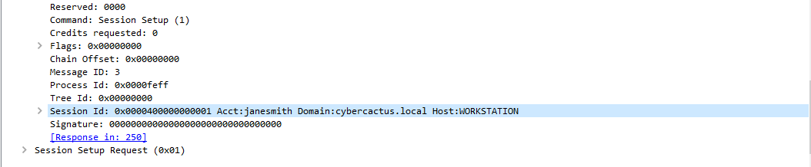
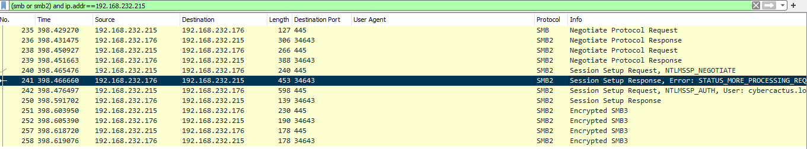
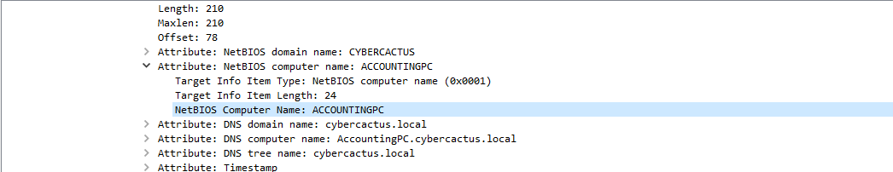

# PoisonedCredentials – Blue Team Lab Report

**Challenge Link:** [PoisonedCredentials | Blue Team Challenge](https://cyberdefenders.org/blueteam-ctf-challenges/poisonedcredentials/)

---

## 1. Identify the Mistyped Query from IP `192.168.232.162`

### Scenario
The attacker initiated their activity by exploiting benign network traffic from legitimate systems. Our objective is to identify the specific mistyped query made by the machine with IP `192.168.232.162`.

### Analysis
- Open the capture in **Wireshark**, and navigate to **Statistics > Protocol Hierarchy**.
- NetBIOS Name Service (NBNS) appears to be the only name service protocol present.



- Apply the following display filter to isolate relevant traffic:
  ```wireshark
  ip.addr == 192.168.232.162 && nbns
  ```

* This returns a single NBNS query from the target machine.



**Answer:** `FILESHAARE` (note the typo in the hostname)



---

## 2. Determine the Rogue Machine's IP Address

### Objective

Identify the IP address of the rogue machine that responded to the mistyped NBNS query.

### Analysis

* Locate the NBNS response packet for the `FILESHAARE` query.
* The IP address responding to the request is `192.168.232.215`.



**Answer:** `192.168.232.215`



---

## 3. Identify the Second Affected Machine

### Objective

Find the IP address of another machine that received a poisoned NBNS response from the rogue machine.

### Analysis

* Use the following Wireshark filter:

  ```wireshark
  ip.src == 192.168.232.215 && nbns
  ```
* The traffic shows another poisoned NBNS response sent to `192.168.232.176`.



**Answer:** `192.168.232.176`

---

## 4. Determine the Compromised Username

### Objective

Identify the username of the account compromised by the attacker using the poisoned credentials.

### Analysis

* Filter for SMB/SMBv2 traffic related to the rogue machine:

  ```wireshark
  ip.addr == 192.168.232.215 && (smb || smb2)
  ```
* Inspect the authentication packets to reveal the username.



**Answer:** `janesmith`



---

## 5. Identify the Hostname Accessed via SMB

### Objective

Determine the hostname of the machine the attacker accessed through SMB.

### Analysis

* Continue reviewing SMB traffic from the rogue machine (`192.168.232.215`).
* The SMB session reveals the hostname: `ACCOUNTINGPC`.



**Answer:** `ACCOUNTINGPC`



---

## ✅ Summary of Answers

| **#** | **Question**              | **Answer**        |
| ----: | ------------------------- | ----------------- |
|     1 | Mistyped Query            | `FILESHAARE`      |
|     2 | Rogue IP Address          | `192.168.232.215` |
|     3 | Second Affected Machine   | `192.168.232.176` |
|     4 | Compromised Username      | `janesmith`       |
|     5 | Hostname Accessed via SMB | `ACCOUNTINGPC`    |

---
