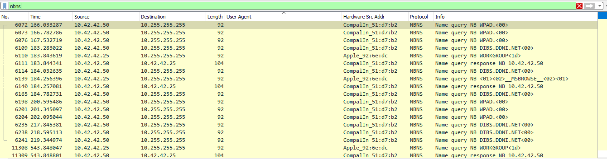

# Port Scan Activity

[Getting Started to LetsDefend](https://app.letsdefend.io/challenge/port-scan-activity)

---

1. **What is the IP address scanning the environment?**  
   - Reviewing the **Protocol Hierarchy** in the Statistics tab of Wireshark shows ICMP packets present in the capture.  
     
     
   
   - Filtering packets to show only **ICMP** packets reveals many such packets.  
     
     
   
   - **Answer:** `10.42.42.253`

2. **What is the IP address found as a result of the scan?**  
   - Filtering the traffic to show **ICMP** packets, you can see three IPs responded to the ICMP Echo Requests:  
     - `10.42.42.50`  
     - `10.42.42.56`  
     - `10.42.42.25`  
   
   - **Answer:** `10.42.42.50`

3. **What is the MAC address of the Apple system it finds?**  
   - By adding a column to show MAC addresses, it is evident that the device with IP `10.42.42.25` is an Apple device.  
     
       
     
   - **Answer:** `00:16:cb:92:6e:dc`  
     
     

4. **What is the IP address of the detected Windows system?**  
   - Filtering packets to show only **NetBIOS** packets (a protocol often running on Windows systems), it is clear that IPs `10.42.42.50` and `10.42.42.25` are Windows systems.  
     
     