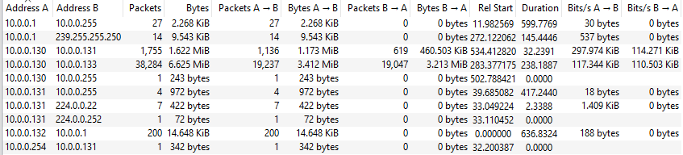
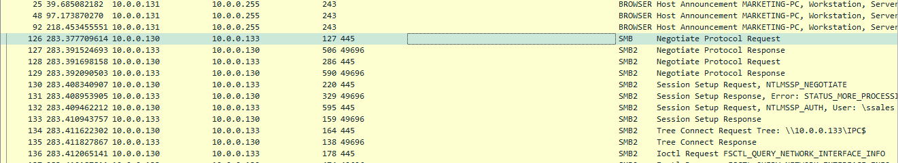
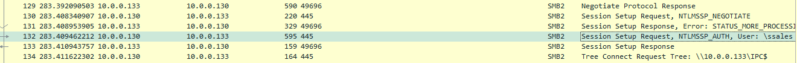
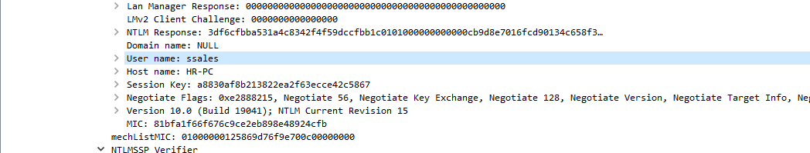
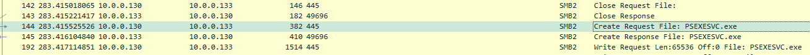
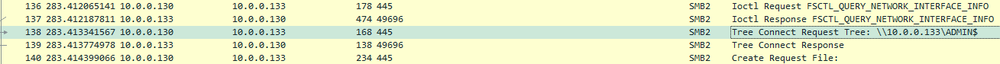
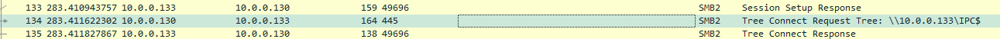
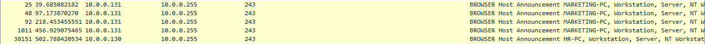

# PsExec Hunt Blue Team Lab

**Challenge Link:** [PsExec Hunt | Blue Team Challenge](https://cyberdefenders.org/blueteam-ctf-challenges/psexec-hunt/)

---

## 1. Identify the Initial Access IP Address

Understanding where the attacker first accessed the network is essential for tracing their actions and containing the breach.

- **Observation:**  
  Wireshark reveals high traffic between IPs `10.0.0.130` and `10.0.0.133`, potentially indicating data exfiltration.

  

- **Analysis:**  
  By filtering for SMB/SMB2 traffic, we see that `10.0.0.130` initiated the **SMB negotiation**, which points to it being the **attacker's IP**.

  

> **Answer:** `10.0.0.130`

---

## 2. Determine the First Pivoted Hostname

Identifying the hostname of the machine the attacker first moved to helps assess the scope of lateral movement.

- **Technique:**  
  The hostname can be found in the **Session Setup Request** packet.

  

> **Answer:** *(Extract the hostname from the image or packet payload)*

---

## 3. Identify the Username Used for Authentication

Knowing the account leveraged during the attack aids in identifying compromised credentials.

- **Method:**  
  Review the same **Session Setup Request** packet used in the previous step.

  

> **Answer:** *(Extract the username from the image or packet payload)*

---

## 4. Discover the Service Executable Used by the Attacker

Determining the name of the executable helps in locating artifacts or processes tied to attacker activity.

- **Finding:**  
  The attacker installed a service named `PSEXESVC`.

  

> **Answer:** `PSEXESVC`

---

## 5. Identify the Network Share Used for Installation

Knowing which share was used helps in auditing access and identifying similar patterns on other hosts.

- **Observation:**  
  The attacker used the `ADMIN$` share to push the service executable to the target.

  

> **Answer:** `ADMIN$`

---

## 6. Identify the Communication Network Share

Understanding how systems communicated supports better monitoring and restriction policies.

- **Detail:**  
  The communication occurred over the `IPC$` share.

  

> **Answer:** `IPC$`

---

## 7. Identify Further Lateral Movement

Tracking additional pivot attempts reveals the breadth of the attacker's reach in the network.

- **Finding:**  
  The attacker attempted to pivot to another machine with the IP `10.0.0.255`.

  

> **Answer:** `10.0.0.255`

---