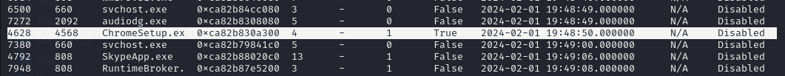
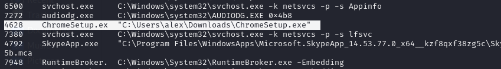
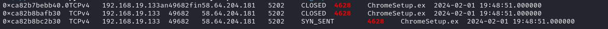
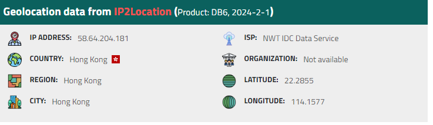
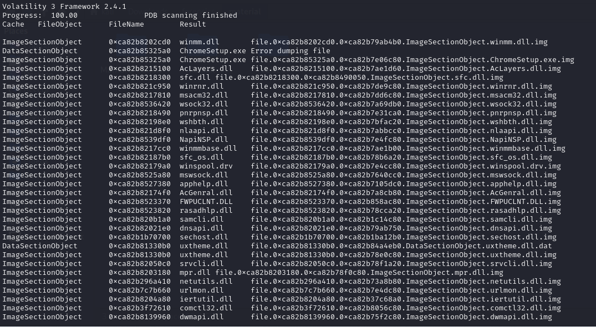
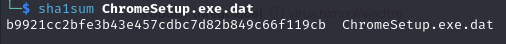
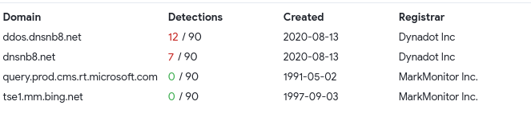

# Ramnit Blue Team Lab

[Challenge Link](https://cyberdefenders.org/blueteam-ctf-challenges/ramnit/)

---

1. **What is the name of the suspicious process?**  
   - Use `windows.pslist` to list all running processes.  
   - Only one stands out as suspicious.  
     
       
   
   - **Answer:** `ChromeSetup.exe`

2. **What is the exact file path of the process executable?**  
   - Use `windows.cmdline` to check command-line arguments and paths for processes.  
     
       
   
   - **Answer:** `C:\Users\alex\Downloads\ChromeSetup.exe`

3. **What is the IP address it attempted to connect to?**  
   - Use `windows.netscan`, and filter by PID `4628` (ChromeSetup.exe).  
   - Command used:  
     ```bash
     python3 vol.py -f /path-to-your-dump-file windows.netscan | grep -i 4628
     ```  
     
       
   
   - **Answer:** `58.64.204.181`

4. **Which city is associated with the IP address the malware communicated with?**  
   - Use [IPLocation.net](https://www.iplocation.net/ip-lookup) to look up the IP.  
     
       
   
   - **Answer:** `Hong Kong`

5. **What is the SHA1 hash of the malware's executable?**  
   - Use `windows.dumpfiles` to extract file contents.  
   - Analyze the resulting executables on [VirusTotal](https://www.virustotal.com/).  
     
       
       
   
   - **Answer:** `b9921cc2bfe3b43e457cdbc7d82b849c66f119cb`

6. **What is the compilation timestamp of the malware?**  
   - Use `pefile` in Python to extract compilation timestamp:
     ```python
     import pefile
     import datetime
     
     pe = pefile.PE("/relative-path-to-this-file/ChromeSetup.exe.dat")
     timestamp = pe.FILE_HEADER.TimeDateStamp
     print("Compilation timestamp:", datetime.datetime.utcfromtimestamp(timestamp))
     ```  
     
       
   
   - **Answer:** `2019-12-01 08:36:04`

7. **Can you provide the domain related to the malware?**  
   - On VirusTotal, check the **Relations** tab for domain activity.  
     
       
   
   - **Answer:** `dnsnb8.net`