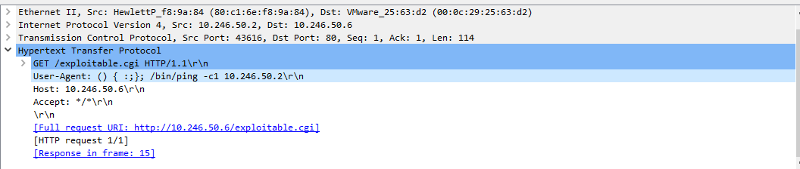

# Shellshock Attack

[Getting Started to LetsDefend](https://app.letsdefend.io/challenge/shellshock-attack)

> 💡 **Shellshock Attack**  
> Shellshock is a security vulnerability discovered in September 2014 in the Unix Bash shell. It allows an attacker to execute arbitrary commands on a vulnerable system. Bash (Bourne Again Shell) is widely used on Unix-like operating systems, including Linux and macOS.

1. **What is the server operating system?**  
   - Filter the traffic to show HTTP packets only.  
     
       
   
   - Open the response for an HTTP GET packet to see server information.  
     
       
   
   - **Answer:** Ubuntu

2. **What is the application server and version running on the target system?**  
   - From the HTTP response in the previous step, identify the server version.  
   - **Answer:** Apache/2.2.22

3. **What is the exact command that the attacker wants to run on the target server?**  
   - The command is clearly visible in the HTTP GET packet sent by the attacker.  
     
       
   
   - **Answer:** `/bin/ping -c1 10.246.50.2`  
     
     