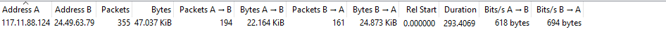
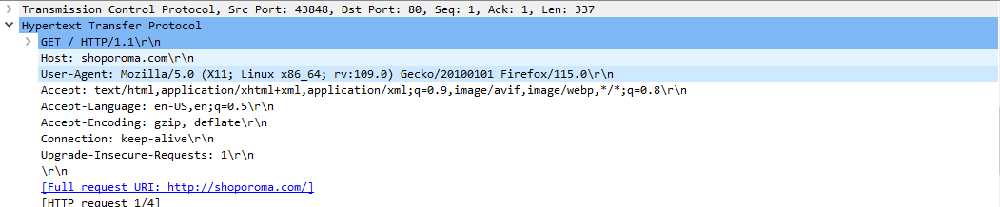
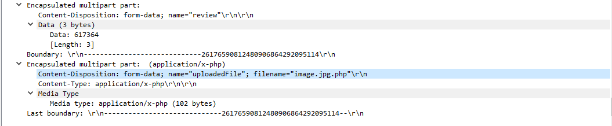
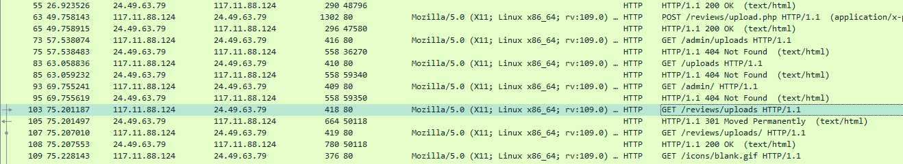
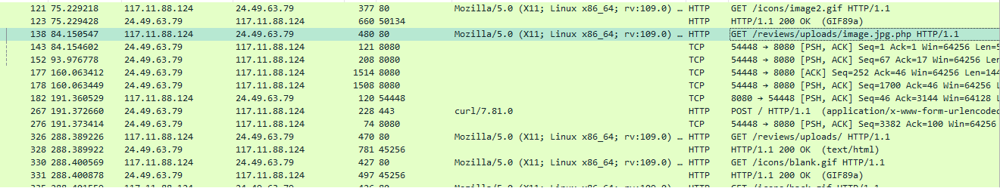
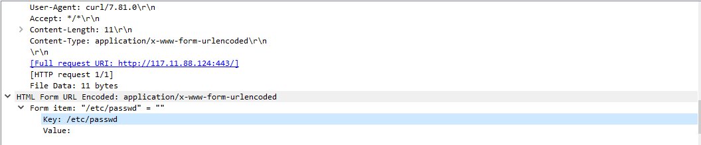

# WebStrike Blue Team Lab

**Challenge Link:** [WebStrike | Blue Team Challenge](https://cyberdefenders.org/blueteam-ctf-challenges/webstrike/)

---

## 1. Identify the City of Origin for the Attack

Understanding the geographical origin of the attack aids in geo-blocking measures and threat intelligence.

- **Observation:**  
  Wireshark reveals a single conversation between two IP addresses. This suggests one IP belongs to the attacker and the other to the target server.

  

- **Analysis:**  
  The IP `117.11.88.124` initiates the connection and sends an HTTP GET request, while the second IP responds with an HTML file related to an online store. This makes `117.11.88.124` the attacker's IP.

- **Geolocation Lookup:**  
  Using [IP Location Lookup](https://www.iplocation.net/ip-lookup), the IP `117.11.88.124` is traced to **Tianjin**.

> **Answer:** `Tianjin`

---

## 2. Determine the Attacker's User-Agent

Knowing the user-agent helps in creating filtering rules and detecting similar activity in the future.

- **Inspection:**  
  Review any packet originating from the attacker's IP `117.11.88.124` to identify the user-agent.

  

> **Answer:** *(Extracted from the packet in the screenshot)*

---

## 3. Identify the Malicious Web Shell

Identifying uploaded malicious files is key to assessing the extent of a compromise.

- **Technique:**  
  Reviewing HTTP POST requests reveals the malicious web shell.

  

> **Answer:** *(Web shell filename as shown in the packet)*

---

## 4. Determine the File Upload Directory

Understanding where files are stored helps secure those directories against unauthorized access.

- **Analysis:**  
  The attacker attempted directory enumeration and ultimately discovered `/reviews/uploads/`. File uploads began to this path thereafter.

  

> **Answer:** `/reviews/uploads/`

---

## 5. Identify the Port Used by the Web Shell

Determining the port helps in tuning firewall rules to block malicious traffic.

- **Observation:**  
  After uploading the malicious file, the attacker accessed it using an HTTP GET request targeting **port 8080**.

  

> **Answer:** `8080`

---

## 6. Determine the File Targeted for Exfiltration

Understanding which files were targeted allows teams to evaluate data exposure risks.

- **Review:**  
  The last HTTP POST request shows the attacker attempting to exfiltrate a specific file.

  

> **Answer:** *(Filename shown in the POST request)*