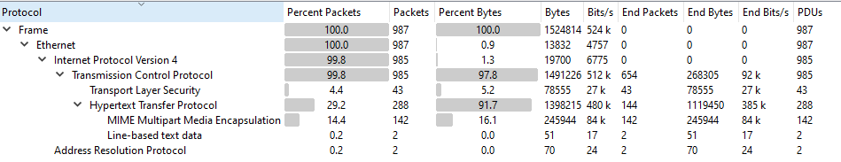
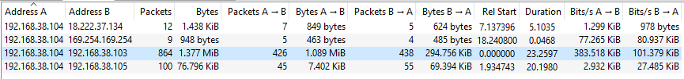
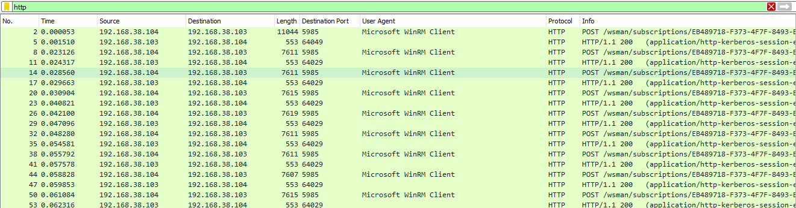
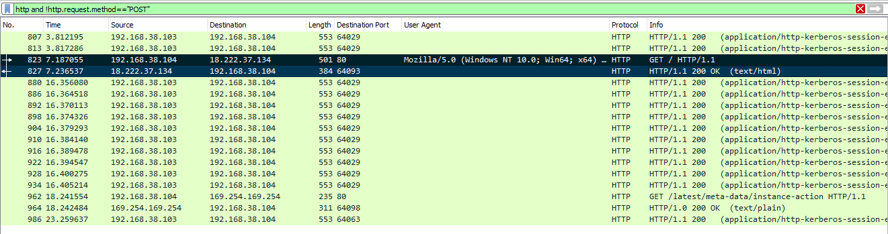
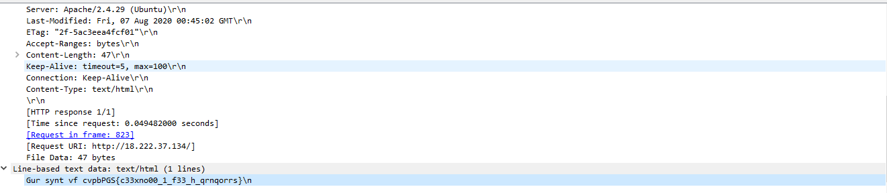

# Wireshark doo dooo do doo...

[picoCTF Challenge](https://play.picoctf.org/practice/challenge/115?page=1&search=shark)

---

- By reviewing the **Protocol Hierarchy**, it is noticeable that the only protocol used is **HTTP**.  
  

- Reviewing the **Conversations**, the traffic in the third conversation is much more congested than others, indicating potential malicious activity.  
  

- Filtering packets to show only **HTTP** packets reveals many HTTP POST requests.  
  

- If this traffic is for uploading a payload (malware), naturally an HTTP GET request will be sent by the attacker to trigger the malware execution.  
  

- Review the **response packet** for this HTTP GET request.  
  

- The response contains text encrypted using the **Caesar Cipher** algorithm.  
- Using any online Caesar Cipher decoder (e.g., [CyberChef](https://cyberchef.org/#recipe=ROT13(true,true,false,13)&input=R3VyIHN5bnQgdmYgY3ZwYlBHU3tjMzN4bm8wMF8xX2YzM19oX3FybnFvcnJzfQ)) gives the answer:

```
picoCTF{p33kab00_1_s33_u_deadbeef}
```