# l337 S4uc3 | Blue Team Lab

[Challenge Link](https://cyberdefenders.org/blueteam-ctf-challenges/l337-s4uc3/)

---

1. **What is the public IP address of the webserver?**  
   - Filter: `http and frame contains "development.wse.local"`  
   - Source IP in response packet:  
   - 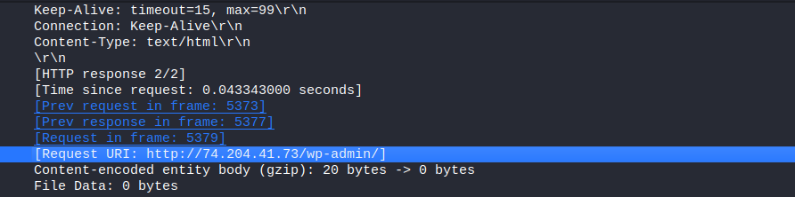  
   - **Answer:** `74.204.41.73`

2. **Arrival time of frame 1 in UTC (GrrCON.pcapng)?**  
   - Set time format to UTC under View → Time Display Format.  
   - 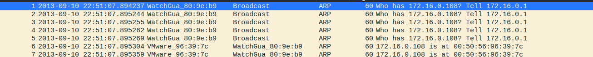  
   - **Answer:** `22:51:07 UTC`

3. **What PHP version is the server running?**  
   - Found in HTTP response headers.  
   - 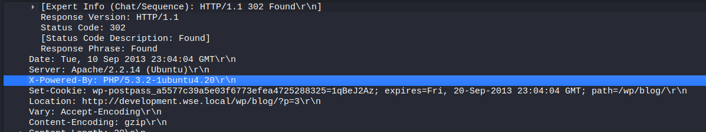  
   - **Answer:** `5.3.2`

4. **What Apache version is the server using?**  
   - Found in HTTP response headers.  
   - 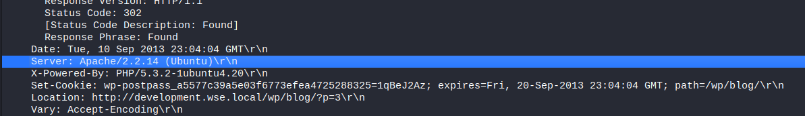  
   - **Answer:** `2.2.14`

5. **Common name of malware in IDS alert?**  
   - 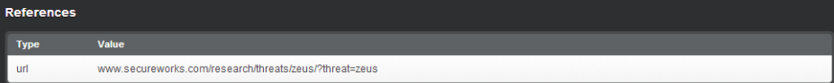  
   - **Answer:** `zeus`

6. **What is the Gateway IP address of the LAN?**  
   - Review ARP broadcast packets.  
   - 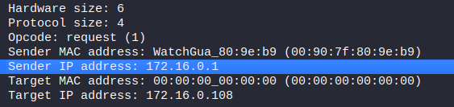  
   - **Answer:** `172.16.0.1`

7. **What IP address was pinged by Zeus bot to verify connectivity?**  
   - 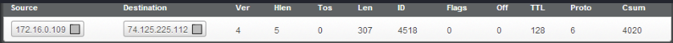  
   - **Answer:** `74.125.225.112`

8. **What is the Zeus C2 server IP address?**  
   - Filter: `http and frame contains ".bin"`  
   - 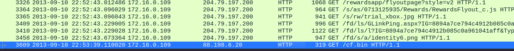  
   - **Answer:** `88.198.6.20`

9. **Filename of the Zeus bot ".bin" config file?**  
   - 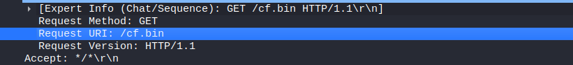  
   - **Answer:** `cf.bin`

10. **What was the WordPress login password used at 6:59 PM EST?**  
    - Source IP: `172.16.0.108`  
    - 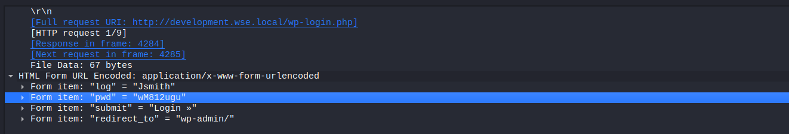  
    - **Answer:** *(Extracted from screenshot)*

11. **Access time of the designs page using password `1qBeJ2Az`?**  
    - Filter: `http and frame contains "1qBeJ2Az"`  
    - 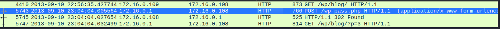  
    - **Answer:** `23:04:04 UTC`

12. **Source port in shellcode exploit (dest port 31708)?**  
    - Filter: `tcp.dstport == 31708 or udp.dstport == 31708`  
    - 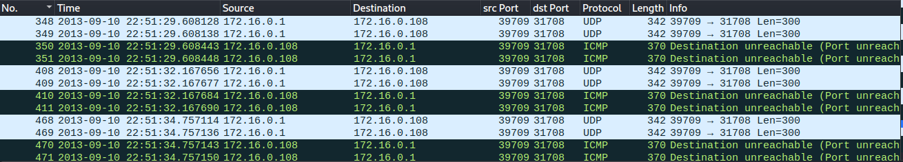  
    - **Answer:** *(Extracted from packet info)*

13. **Linux kernel version returned from `sysinfo`?**  
    - 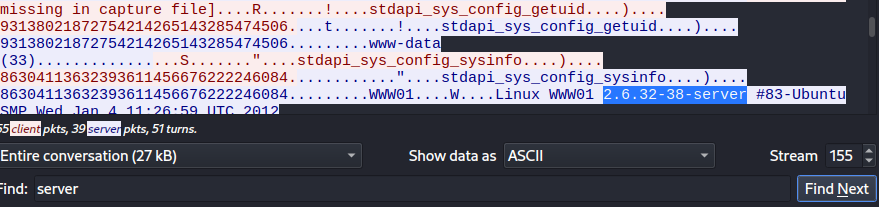  
    - **Answer:** `2.6.32-38-server`

14. **Token value in frame 3897?**  
    - 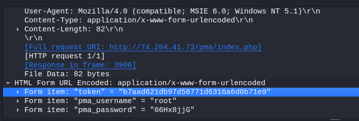  
    - **Answer:** `b7aad621db97d56771d6316a6d0b71e9`

15. **Tool used to download compressed file?**  
    - Filter: `http.request.method == "GET" and (frame contains ".zip" or ".rar" or ".tar")`  
    - 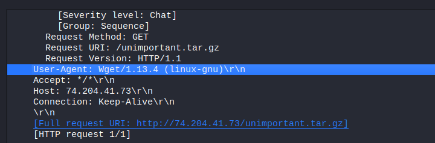  
    - **Answer:** `Wget`

16. **Download filename used to launch Zeus bot?**  
    - 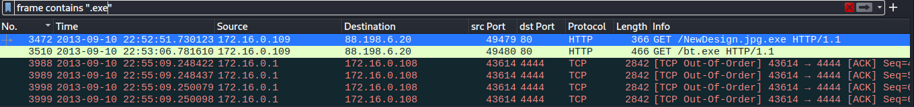  
    - **Answer:** `bt.exe`

17. **Full file path of system shell spawned via meterpreter session?**  
    - Used plugins: `imageinfo`, `linux_pslist`, `linux_pstree`, `linux_psaux`  
    - 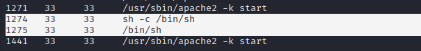  
    - **Answer:** `/bin/sh`

18. **Parent Process ID (PPID) of the two 'sh' sessions?**  
    - 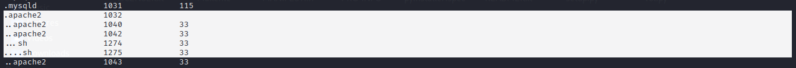  
    - **Answer:** `1042`

19. **Latency record count for PID 1274?**  
    - Used `linux_volshell` and process offset.  
    - 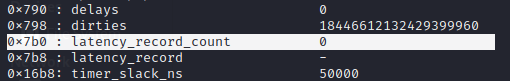  
    - **Answer:** `0`

20. **First mapped file path for PID 1274?**  
    - Plugin: `linux_proc_map`  
    - 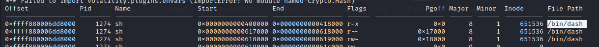  
    - **Answer:** `/bin/dash`

21. **MD5 hash of `receive.1105.3` from per-process packet queue?**  
    - Used `linux_pkt_queues` and `md5sum`  
    - 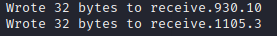  
    - **Answer:** `184c8748cfcfe8c0e24d7d80cac6e9bd`